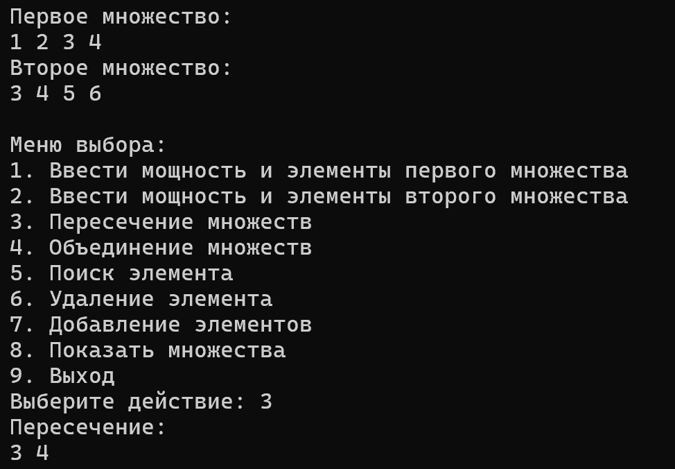
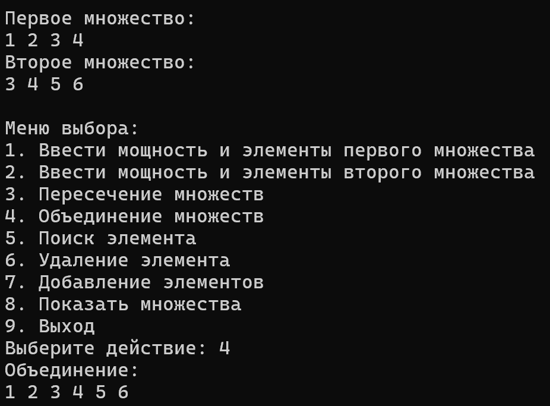
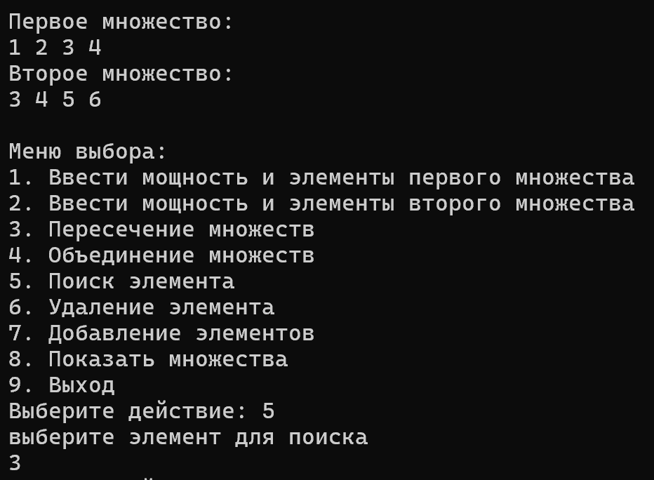
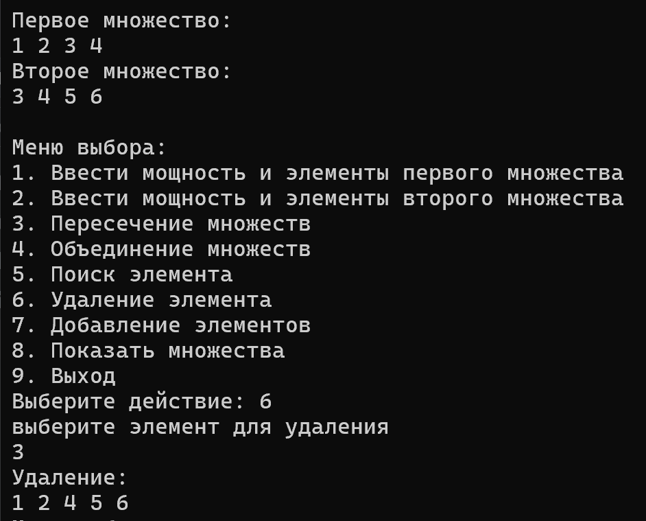

<h1 align="center">Лабораторная работа №1</h1>

## Вариант №2
_**Множество. Добавление элемента во множество. Удаление элемента из множества. Поиск элемента во множестве. Объединение двух множеств. Пересечение двух множеств.**_

* ## Цели лабораторной работы:

Разработать библиотеку для работы с очередью на выбранном императивном языке программирования (например, C++, Java, Python).
Создать тестовую программу для демонстрации функциональности разработанной библиотеки.
Разработать систему тестов для проверки работоспособности и корректности библиотеки, учитывая требования полноты, адекватности и непротиворечивости.
Обеспечить обработку некорректных данных, предусмотрев корректное завершение программы при возникновении ошибок.
Составить отчет по выполнению лабораторной работы.

* ## Задачи лабораторной работы

Изучить спецификацию задачи по работе с множествами.
Выбрать язык программирования для реализации библиотеки (например, C++, Java, Python) в соответствии с индивидуальным заданием.
Разработать и реализовать библиотеку для работы с множествами, включая операции вставки и удаления элементов.
Написать тестовую программу, которая демонстрирует основные сценарии использования библиотеки.
Разработать систему тестов, включающую тест-кейсы для проверки различных аспектов работы библиотеки, включая корректность, производительность и обработку ошибок.
Провести тестирование разработанной библиотеки, убедившись в ее правильной работе на различных входных данных.
Составить подробный отчет, включая описание решения задачи, архитектуры библиотеки, результаты тестирования и выводы.

## Список используемых понятий:

- **`Множество`** — набор, совокупность каких-либо объектов

- **`Объединением множеств А и В`** — множество, содержащее все элементы, принадлежащие либо множеству А, либо В, либо им обоим.

- **`Пересечением множеств А и В`** — множество, состоящее из всех элементов, принадлежащих одновременно каждому из множеств А и В.


## Описание используемых алгоритмов:

- ### Алгоритм добавления элемента:

_Этот алгоритм добавляет элемент в множество. Добавление сделано так, чтобы элементы множества не повторялись и были различны._

```c++
void Add(prikol*& current, int value) {
    if (!current) {
        current = new prikol(value);
        return;
    }
    else if (value < current->data) {
        Add(current->left, value);
    }
    else if (value > current->data) {
        Add(current->right, value);
    }
    else {
        return;
    }
}
```
- ### Алгоритм удаления элемента:

_Этот алгоритм удаляет заданный элемент, если такой имеется. В противном случае ничего не произойдет._

```c++
void removeNode(prikol*& current, int value) {
    if (current == nullptr) {
        return;
    }
    if (value < current->data) {
        removeNode(current->left, value);
    }
    else if (value > current->data) {
        removeNode(current->right, value);
    }
    else {
        if (current->left == nullptr) {
            prikol* temp = current;
            current = current->right;
            delete temp;
        }
        else if (current->right == nullptr) {
            prikol* temp = current;
            current = current->left;
            delete temp;
        }
        else {
            prikol* minRight = findMinNode(current->right);
            current->data = minRight->data;
            removeNode(current->right, minRight->data);
        }
    }
}
```
- ### Алгоритм поиска элемента

_Данный алгоритм ищет заданный элемент и возвращает ссылку, если элемент найден._

```c++
prikol* findMinNode(prikol* node) {
    if (node == nullptr) {
        return nullptr;
    }
    else if (node->left == nullptr) {
        return node;
    }
    else {
        return findMinNode(node->left);
    }
}
```

- ### Функция для вывода множества на экран:
  
_Отображает множество в консоли._
  
```c++
void view(prikol* node) {
    if (!node) return;
    view(node->left);
    cout << node->data << " ";
    view(node->right);
}
```

- ### Алгоритм объединения множеств:
  
```c++
void add1(prikol*& current, prikol*& mnozhC) {
    if (!current) return;
    Add(mnozhC, current->data);
    add1(current->right, mnozhC);
    add1(current->left, mnozhC);
}

void unity(prikol* mnozhA, prikol* mnozhB, prikol*& mnozhC) {
    add1(mnozhA, mnozhC);
    add1(mnozhB, mnozhC);
}
```

- ### Алгоритм пересечения множеств:

_В данном алгоритме каждый элемент множества А сравнивается с каждым элементом множества В. При совпадении элемент добавляется в пересечение._

```c++
void check(int value, prikol* node, prikol*& mnozhC) {
    if (!node) return;
    if (node->data == value) {
        Add(mnozhC, value);
        return;
    }
    check(value, node->left, mnozhC);
    check(value, node->right, mnozhC);
}

void intersection(prikol* mnozhA, prikol* mnozhB, prikol*& mnozhC) {
    if (!mnozhA) return;
    check(mnozhA->data, mnozhB, mnozhC);
    intersection(mnozhA->left, mnozhB, mnozhC);
    intersection(mnozhA->right, mnozhB, mnozhC);
}
```
<h1 align="center">Тесты:</h1>

* ### Тест №1 (Пересечение)
  

* ### Тест №2 (Объединение)


* ### Тест №3 (Поиск)


* ### Тест №4 (Удаление)


<h1 align="center">Вывод:</h1>

В ходе выполнения работы познакомился созданием библиотек в С++, реализоавал библиотеку работы с массивами,а также создал систему тестов,которая проверяет корректность созданной библиотеки, отточил свои навыки в создании структур и функций.

## Используемые источники:

* [Литература](https://drive.google.com/drive/folders/1TQIRHSvx9h-hKDqpUAZELyWB6S1k1OgA)
* [Создание библиотеки](https://www.youtube.com/watch?v=pAxEfF2yVlM&t=1s&ab_channel=%23SimpleCode)


