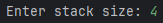
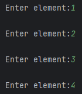
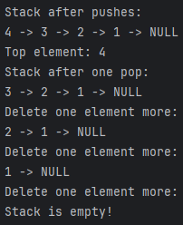

# Лабораторная работа №1

**Бибко Владислав, 421701**

### Вариант 23: Стек: Вставка элемент в стек. Взятие элемента из стека. 

# Реализация стека на C++

Это простая программа на C++, которая реализует структуру данных **стек** с использованием связного списка. Программа позволяет пользователю вводить элементы, добавлять их в стек, удалять элементы из стека и выводить содержимое стека.

## Как работает программа

#### Сам код находиться по ссылке: [Code](https://github.com/iis-42x70x/RPIIS/tree/%D0%91%D0%B8%D0%B1%D0%BA%D0%BE_%D0%92/sem2/lab1/Code)

### Основные функции

1. **`push(Node*& top, int value)`**:
    - Добавляет элемент на вершину стека.
    - Создает новый узел, записывает в него данные и обновляет вершину стека.

2. **`pop(Node*& top)`**:
    - Удаляет элемент с вершины стека.
    - Если стек пуст, выводит сообщение об ошибке.

3. **`peek(Node* top)`**:
    - Возвращает значение верхнего элемента стека без его удаления.
    - Если стек пуст, возвращает `-1`.

4. **`display(Node* top)`**:
    - Выводит все элементы стека, начиная с вершины.

5. **`inputStack(Node*& top)`**:
    - Запрашивает у пользователя количество элементов и их значения.
    - Добавляет элементы в стек с помощью функции `push`.

### Как использовать программу

1. **Запуск программы**:
    - Скомпилируйте и запустите программу с помощью компилятора C++.

2. **Ввод элементов**:
    - Программа запросит количество элементов, которые вы хотите добавить в стек.
    - Затем введите каждый элемент по очереди.

3. **Вывод стека**:
    - После ввода элементов программа выведет содержимое стека.

4. **Удаление элементов**:
    - Программа начнет удалять элементы из стека по одному, начиная с вершины.
    - После каждого удаления будет выводиться текущее состояние стека.

5. **Завершение работы**:
    - Когда стек станет пустым, программа завершит работу.

### Пример работы программы

1. ***Ввод количества элементов:***

   

2. ***Ввод элементов***

   

3. ***Вывод стека, и удаление элементов***

   
4. щшхе78е89нзщна8ез9ж yuftyyufiytvougou
вкпвпкп gdrzrgrgdzvfgrzgfvzrgzdrzdg rgnzdrybgrzi;vzrdg